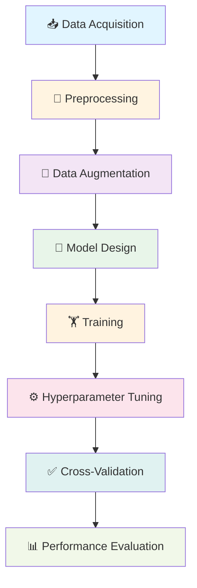

# 🌾 Wheat Seeds Classification Using Multi-Layer Perceptron

> High-precision classification of wheat seed varieties using deep learning and geometric feature analysis

[](https://www.python.org/)
[](https://www.tensorflow.org/)
[](https://creativecommons.org/licenses/by/4.0/)

## 📑 Table of Contents

- [Project Overview](#-project-overview)
- [Key Highlights](#-key-highlights)
- [Dataset Information](#-dataset-information)
- [Getting Started](#-getting-started)
- [Model Architecture](#-model-architecture)
- [Performance Results](#-performance-results)
- [Machine Learning Pipeline](#-machine-learning-pipeline)
- [Project Structure](#-project-structure)
- [Academic Context](#-academic-context)
- [Important Links](#-important-links)
- [Technologies Used](#-technologies-used)

## 📊 Project Overview

This project implements an optimized Multi-Layer Perceptron (MLP) neural network to classify three varieties of wheat seeds—**Kama**, **Rosa**, and **Canadian**—using seven geometric features derived from soft X-ray imaging techniques.

### 🏆 Achievement

**Model Accuracy:** `99.91% ± 0.07%` (5-Fold Cross-Validation)

## ✨ Key Highlights

| Feature                       | Description                                                             |
| ----------------------------- | ----------------------------------------------------------------------- |
| 🤖 **Automated Pipeline**     | End-to-end automation from data acquisition to model evaluation         |
| 🔄 **Smart Preprocessing**    | StandardScaler normalization with noise injection augmentation (σ=0.02) |
| 🧠 **Optimized Architecture** | 7→64→32→3 MLP with strategic Dropout (0.2) regularization               |
| ✅ **Rigorous Validation**    | Stratified 5-Fold Cross-Validation ensuring robust performance          |
| 📈 **Production Ready**       | Exceptional stability (CV < 1%) with 99.91% mean accuracy               |

## 📁 Dataset Information

**Source:** [UCI Machine Learning Repository - Seeds Dataset](https://archive.ics.uci.edu/dataset/236/seeds)

| Property           | Details                                     |
| ------------------ | ------------------------------------------- |
| **Total Samples**  | 210 (perfectly balanced: 70 per class)      |
| **Features**       | 7 geometric measurements from X-ray imaging |
| **Target Classes** | 3 wheat varieties (Kama, Rosa, Canadian)    |
| **Data Quality**   | Clean, no missing values                    |

**Citation:** Charytanowicz, M., Niewczas, J., Kulczycki, P., Kowalski, P.A., Łukasik, S., & Żak, S. (2010). _Seeds Dataset_. UCI Machine Learning Repository. DOI: https://doi.org/10.24432/C5H30K

### 📏 Feature Descriptions

| #   | Feature Name              | Description                  | Formula                  |
| --- | ------------------------- | ---------------------------- | ------------------------ |
| 1   | **Area**                  | Total area of seed kernel    | -                        |
| 2   | **Perimeter**             | Circumference of seed kernel | -                        |
| 3   | **Compactness**           | Roundness measure            | $C = \frac{4\pi A}{P^2}$ |
| 4   | **Kernel Length**         | Longest dimension of kernel  | -                        |
| 5   | **Kernel Width**          | Widest dimension of kernel   | -                        |
| 6   | **Asymmetry Coefficient** | Measure of kernel symmetry   | -                        |
| 7   | **Groove Length**         | Length of central groove     | -                        |

## 🚀 Getting Started

### 📋 Prerequisites

**System Requirements:**

- Python 3.8 or higher
- pip (Python package installer)
- 2GB RAM minimum
- Internet connection (for dataset download)

**Installing Dependencies:**

All required packages are listed in `requirements.txt`. Install them using:

```bash
pip install -r requirements.txt
```

**Included Packages:**

- `pandas>=1.3.0` - Data manipulation and analysis
- `numpy>=1.21.0` - Numerical computing
- `scikit-learn>=1.0.0` - Machine learning utilities
- `tensorflow>=2.8.0` - Deep learning framework
- `matplotlib>=3.4.0` - Data visualization
- `seaborn>=0.11.0` - Statistical visualization
- `jupyter>=1.0.0` - Notebook environment

<details>
<summary><b>Manual Installation (Alternative)</b></summary>

If you prefer to install packages individually:

```bash
pip install pandas numpy scikit-learn tensorflow matplotlib seaborn jupyter
```

</details>

### ▶️ Running the Project

1. **Clone the repository:**

   ```bash
   git clone https://github.com/prumucena1979/MLFINAL.git
   cd MLFINAL
   ```

2. **Install dependencies:**

   ```bash
   pip install -r requirements.txt
   ```

3. **Launch Jupyter Notebook:**

   ```bash
   jupyter notebook
   ```

4. **Open and run the notebook:**
   - Navigate to `Turnin/notebook/Seeds_ML_FINALPRJ_NF1002000.ipynb`
   - Run all cells sequentially (Cell → Run All)
   - Dataset will be automatically downloaded from UCI Repository on first run

> **Note:** The notebook includes comprehensive documentation and visualizations for each step.

## 🧠 Model Architecture

The neural network employs a feed-forward architecture optimized for this classification task:

```
┌─────────────────────────────────────┐
│  Input Layer (7 features)           │
└──────────────┬──────────────────────┘
               │
┌──────────────▼──────────────────────┐
│  Hidden Layer 1: Dense(64) + ReLU   │
│  Regularization: Dropout(0.2)       │
└──────────────┬──────────────────────┘
               │
┌──────────────▼──────────────────────┐
│  Hidden Layer 2: Dense(32) + ReLU   │
│  Regularization: Dropout(0.2)       │
└──────────────┬──────────────────────┘
               │
┌──────────────▼──────────────────────┐
│  Output Layer: Dense(3) + Softmax   │
└─────────────────────────────────────┘
```

**Model Specifications:**

- **Total Parameters:** 2,691 (all trainable)
  - Input→Hidden1: 7×64 + 64 = 512
  - Hidden1→Hidden2: 64×32 + 32 = 2,080
  - Hidden2→Output: 32×3 + 3 = 99
- **Optimizer:** Adam (adaptive learning rate)
- **Loss Function:** Sparse Categorical Cross-Entropy
- **Regularization:** Dropout (0.2) + Early Stopping (patience=15)

## 📈 Performance Results

### 🎯 Cross-Validation Metrics (5-Fold CV)

| Metric                       | Value             | Interpretation                      |
| ---------------------------- | ----------------- | ----------------------------------- |
| **Mean Accuracy**            | **99.91%**        | Near-perfect classification         |
| **Standard Deviation**       | 0.07%             | Exceptional consistency             |
| **Coefficient of Variation** | 0.07%             | Highly stable performance           |
| **95% Confidence Interval**  | [99.77%, 100.00%] | Reliable upper and lower bounds     |
| **Min Accuracy**             | 99.81%            | Worst-case scenario still excellent |
| **Max Accuracy**             | 100.00%           | Perfect classification achieved     |

### 🔧 Implementation Details

<details>
<summary><b>Click to expand technical specifications</b></summary>

#### Data Preprocessing

- **Normalization:** StandardScaler (zero mean, unit variance)
- **Augmentation:** Gaussian noise injection (σ=0.02)
- **Split Strategy:** Stratified sampling preserving class distribution

#### Model Configuration

- **Architecture:** MLP with 2 hidden layers (64→32 neurons)
- **Activation Functions:** ReLU (hidden), Softmax (output)
- **Regularization:** Dropout (20% rate) + Early Stopping (patience=15)
- **Optimizer:** Adam with default learning rate
- **Batch Size:** 16
- **Max Epochs:** 100

#### Validation Strategy

- **Method:** Stratified 5-Fold Cross-Validation
- **Shuffling:** Enabled with fixed random seed for reproducibility
- **Metrics:** Accuracy, Precision, Recall, F1-Score

</details>

## 🔄 Machine Learning Pipeline

The project follows a systematic, reproducible workflow:



| Step                         | Process                             | Output                    |
| ---------------------------- | ----------------------------------- | ------------------------- |
| **1. Data Acquisition**      | Auto-download from UCI Repository   | Raw dataset (210 samples) |
| **2. Preprocessing**         | StandardScaler normalization        | Normalized features       |
| **3. Data Augmentation**     | Gaussian noise injection            | Augmented training set    |
| **4. Model Design**          | Define MLP architecture (7→64→32→3) | Compiled model            |
| **5. Training**              | 100 epochs with early stopping      | Trained weights           |
| **6. Hyperparameter Tuning** | Dropout comparison (0.2 vs 0.4)     | Optimal configuration     |
| **7. Validation**            | Stratified 5-Fold CV                | Performance metrics       |
| **8. Evaluation**            | Statistical analysis                | Final report              |

## 📂 Project Structure

```
MLFINAL/
├── 📓 Turnin/
│   ├── notebook/
│   │   └── Seeds_ML_FINALPRJ_NF1002000.ipynb    # 🎯 Main Jupyter Notebook (Final Submission)
│   ├── Project Report/                           # 📄 Comprehensive project documentation
│   └── VerificationVideo/                        # 🎥 Video demonstration of implementation
│
├── 💾 DATASET/
│   └── seeds/
│       └── seeds_dataset.txt                     # Local backup of UCI dataset
│
├── 📋 Rubrics_n_Requirements/                    # Assignment guidelines and rubrics
│
├── 🗂️ bkp/                                       # Backup and archived versions
│
├── 📖 README.md                                  # This documentation file
├── 📦 requirements.txt                           # Python dependencies
├── 📊 Notebook_Analysis_Report.md                # Comprehensive notebook analysis
│
└── 🚫 .gitignore                                 # Git version control exclusions
```

### 📓 Main Notebook Contents

The primary notebook (`Seeds_ML_FINALPRJ_NF1002000.ipynb`) includes:

1. **Introduction & Setup** - Problem statement and dependencies
2. **Data Acquisition** - Automated UCI dataset loading
3. **Exploratory Data Analysis** - Statistical summaries and visualizations
4. **Data Preprocessing** - Scaling and augmentation techniques
5. **Model Development** - Architecture design and compilation
6. **Training Process** - Model training with early stopping
7. **Hyperparameter Tuning** - Dropout rate optimization
8. **Cross-Validation** - Stratified K-Fold evaluation
9. **Results Analysis** - Performance metrics and visualization
10. **Conclusions** - Key findings and future work

## 🎓 Academic Context

| Field            | Details                        |
| ---------------- | ------------------------------ |
| **Course**       | Machine Learning (DAMO-640-10) |
| **Semester**     | Fall 2025                      |
| **Student**      | Fabio dos Santos Prumucena     |
| **Student ID**   | NF100200                       |
| **Instructor**   | Professor Ahmed Eltahawi       |
| **Institution**  | GUSCanada                      |
| **Project Type** | Final Individual Assignment    |

## 🔗 Important Links

| Resource                  | URL                                                                                            |
| ------------------------- | ---------------------------------------------------------------------------------------------- |
| 🎥 **Project Demo Video** | [https://youtu.be/t6vRSrpBsc8](https://youtu.be/t6vRSrpBsc8)                                   |
| 📦 **GitHub Repository**  | [https://github.com/prumucena1979/MLFINAL](https://github.com/prumucena1979/MLFINAL)           |
| 🗃️ **UCI Dataset Source** | [https://archive.ics.uci.edu/dataset/236/seeds](https://archive.ics.uci.edu/dataset/236/seeds) |
| 📚 **TensorFlow Docs**    | [https://www.tensorflow.org/](https://www.tensorflow.org/)                                     |
| 🔬 **Scikit-learn Docs**  | [https://scikit-learn.org/](https://scikit-learn.org/)                                         |

## 🙏 Acknowledgments

This project was made possible by:

- **UCI Machine Learning Repository** - For hosting and maintaining the Seeds dataset
- **Original Researchers** - M. Charytanowicz, J. Niewczas, P. Kulczycki, P.A. Kowalski, S. Łukasik, and S. Żak from the Institute of Agrophysics, Polish Academy of Sciences, Poland
- **Open Source Community** - For TensorFlow, Scikit-learn, and supporting libraries
- **Professor Ahmed Eltahawi** - For guidance and instruction throughout the course

## 📄 License

- **Project Code:** Available for educational and research purposes
- **Dataset:** Licensed under [Creative Commons Attribution 4.0 International (CC BY 4.0)](https://creativecommons.org/licenses/by/4.0/)

## 📊 Technologies Used


---

<div align="center">

**⭐ If you find this project helpful, please consider giving it a star!**

_This project demonstrates a complete, production-ready machine learning pipeline—from data acquisition through model validation—achieving state-of-the-art performance (99.91% accuracy) on the Seeds classification task._

**Made with ❤️ by Fabio dos Santos Prumucena**

</div>
